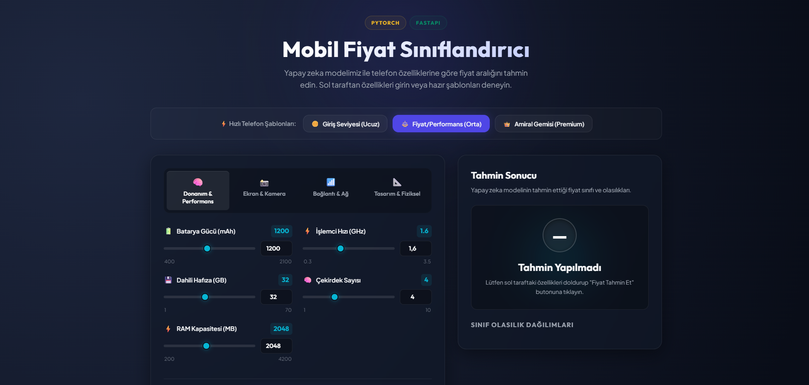
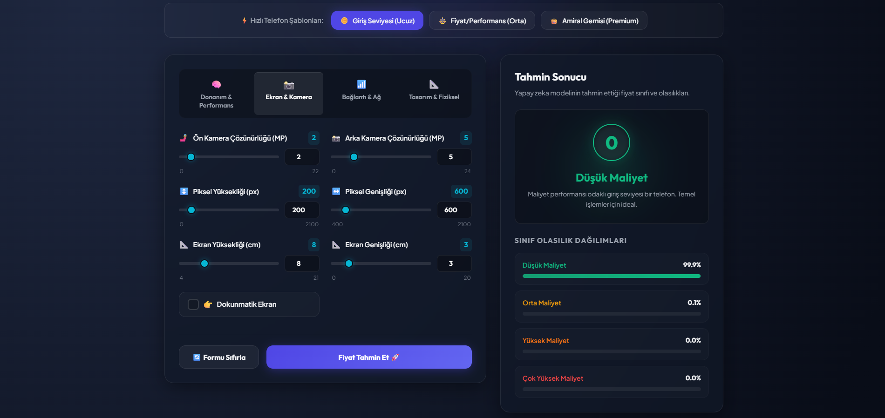
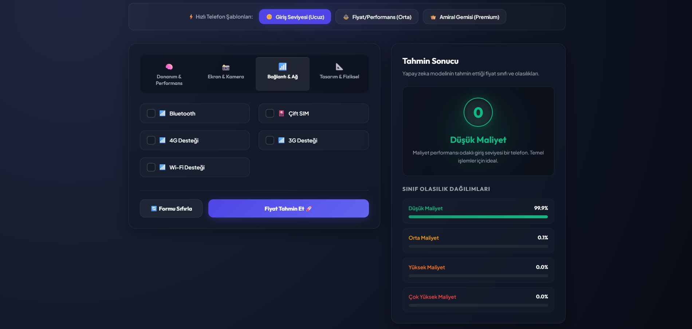

# Mobile-Price-Classification-Webapp with PyTorch & FastAPI

An end-to-end deep learning project that predicts mobile phone price ranges based on their technical specifications. The project features a robust **PyTorch** neural network model backend and a modern, responsive web user interface powered by **FastAPI**.

## 🚀 Live Demo & Preview
Here is a look at the web application interface showing hardware inputs, quick templates, and real-time class probability distributions:

<table>
  <tr>
    <td></td>
    <td></td>
  </tr>
  <tr>
    <td></td>
    <td></td>
  </tr>
</table>

### Key Features of the Web App
* **Interactive Parameters:** Tweak hardware, camera, connectivity, and physical aspects dynamically using sliders and toggles.
* **Quick Templates:** Instantly load presets for **Giriş Seviyesi (Ucuz)**, **Fiyat/Performans (Orta)**, or **Amiral Gemisi (Premium)** devices.
* **Softmax Probability Distributions:** Displays the exact confidence percentage for all 4 price classes in real-time.

---

## 📊 Dataset & Features
The model is trained on a comprehensive mobile phone specification dataset containing **2000 samples** and **20 distinct features** including:
* **Hardware & Performance:** RAM, Battery Power, Clock Speed, Internal Memory, Number of Cores.
* **Display & Camera:** Pixel Height/Width, Screen Dimensions, Front/Primary Camera MP, Touch Screen status.
* **Connectivity & Physical:** 4G/3G, Dual SIM, Wi-Fi, Bluetooth, Mobile Weight, Thickness, Talk Time.

**Target Variable (`price_range`):** 
* `0` (Düşük Maliyet)
* `1` (Orta Maliyet)
* `2` (Yüksek Maliyet)
* `3` (Çok Yüksek Maliyet)

---

## 🧠 Model Architecture
The deep learning classifier is built using PyTorch's `nn.Module` framework. It utilizes a fully connected non-linear architecture engineered to mitigate overfitting while optimizing multiclass accuracy.

```python
class NonlinearModel(nn.Module):
    def __init__(self):
        super().__init__()
        self.layer_batch = nn.Sequential(
            nn.Linear(20, 64),
            nn.ReLU(),
            nn.Dropout(p=0.3),
            nn.Linear(64, 64),
            nn.ReLU(),
            nn.Dropout(p=0.3),
            nn.Linear(64, 4)
        )

    def forward(self, x):
        return self.layer_batch(x)
